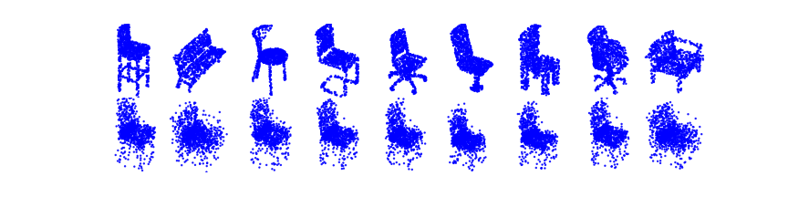
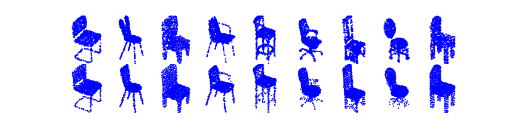
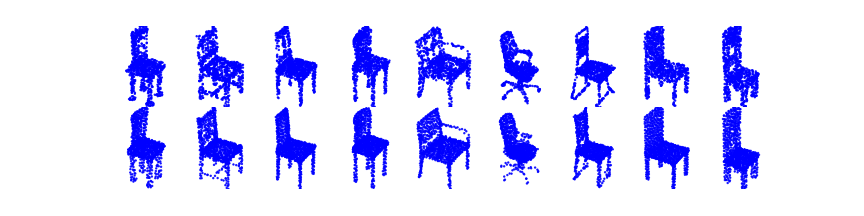

# Point Cloud Autoencoder
A Jupyter notebook containing a PyTorch implementation of Point Cloud Autoencoder inspired from ["Learning Representations and Generative Models For 3D Point Clouds"](https://arxiv.org/abs/1707.02392). Encoder is a [PointNet](https://arxiv.org/abs/1612.00593)  model with 3 1-D convolutional layers, each followed by a ReLU and batch-normalization. Decoder is a MLP with 3 fully connected layers with ReLU activations except the output layer.

## Data
Dataset is sampled from ["A Scalable Active Framework for Region Annotation in 3D Shape Collections"](https://cs.stanford.edu/~ericyi/papers/part_annotation_16_small.pdf). 3746 point cloud models in "chair" category are randomly downsampled to 1024 points. The result is saved as a numpy array with 3746x1024x3 dimensions. You can use your own data by feeding the _pc_array_ with a numpy array using the same data format.

## Results
| **Epoch 1** |
|     :---:      |
|| 
| **Epoch 500** |
|| 
| **Epoch 1000** |
|| 

## Environment
```
Tested with:
PyTorch v1.5.0  
PyTorch3D v0.2  
Nvidia RTX2070 with CUDA 10.2
```
